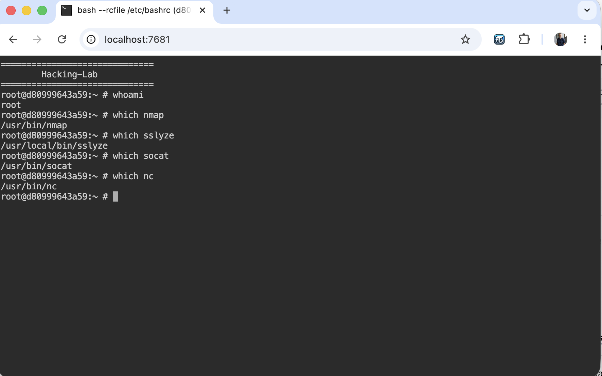

# alpine-ttyd-nmap-sslyze-hl
## Introduction
Alpine Docker Image with ttyd-hl
- nmap
- socat
- sslyze
- socat
* problem: libwebsockets without -DLWS_WITH_LIBUV=ON breaks ttyd package
* fixing the problem with https://github.com/void-linux/void-packages/issues/19441
* fixing the problem with https://gitlab.alpinelinux.org/alpine/aports/-/issues/11936
* fixing the problem: libwebsockets context creation failed



## Base Image
https://github.com/Hacking-Lab/alpine-base-hl

## Docker Hub
https://hub.docker.com/repository/docker/hackinglab/alpine-ttyd-nmap-sslyze-hl

```bash
services:
  alpine-ttypd-nmap-sslyze-hl:
    build: .
    image: hackinglab/alpine-ttyd-nmap-sslyze-hl:3.2
    restart: always
    environment:
    - AUTHOR=e1
    - HL_USER_USERNAME=root
    - HL_USER_PASSWORD=compass
    - HL_ROOT_PASSWORD=compass
    - GOLDNUGGET=flag
    ports:
      - 7681:7681
```


## References
* fix is based on https://github.com/matti/docker-alpine-libwebsockets-with-libuv
* https://github.com/tsl0922/ttyd
